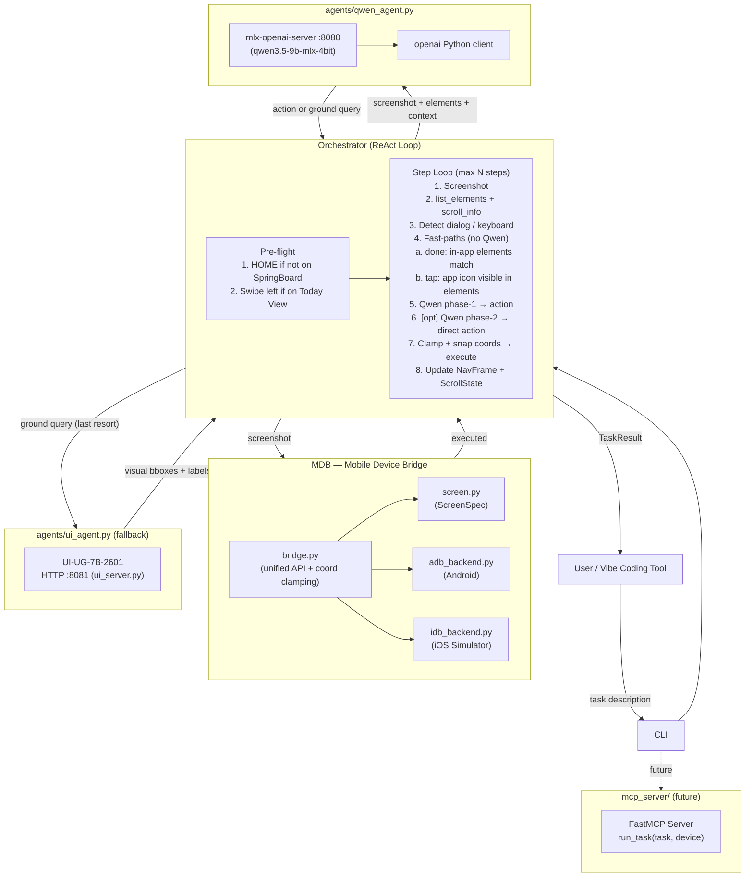

# auto-simctl: Intelligent Mobile Simulator Control

> **The missing feedback loop for vibe coding on mobile** — AI agent takes screenshots, understands the UI via the accessibility tree, reasons with Qwen, executes actions, and reports results, enabling autonomous mobile QA directly in the coding loop.

## Goal

Close the vibe coding feedback gap: AI agent reads a task, takes screenshots from real/simulated devices, understands the UI via the accessibility tree, executes actions, and reports back — enabling autonomous mobile QA in the coding loop.

---

## Current Status

| Area                        | Status     | Notes                                                          |
|-----------------------------|------------|----------------------------------------------------------------|
| MDB unified bridge          | ✅ Done     | `adb` + `idb`, all core actions; coordinate clamping          |
| iOS accessibility tree      | ✅ Done     | `list_elements()`, `get_scroll_info()`                        |
| Qwen-as-director            | ✅ Done     | Adaptive thinking; phase-1 + phase-2 reasoning loop           |
| Navigation stack            | ✅ Done     | `NavFrame` + `ScrollState` per frame                          |
| Scroll awareness            | ✅ Done     | off-screen element detection, scroll recipes                   |
| System dialog detection     | ✅ Done     | auto-dismiss permission / alert dialogs                        |
| Keyboard detection          | ✅ Done     | `input_text()` triggered when keyboard is open                |
| Dead-end detection          | ✅ Done     | same action 3× → force HOME                                   |
| Semantic language bridging  | ✅ Done     | Qwen maps Chinese task → English labels, no tables            |
| Fast-paths (no Qwen)        | ✅ Done     | app icon visible / in-app elements / foreground match → done  |
| Pre-flight home reset       | ✅ Done     | HOME + Today View detection → swipe to page 0                 |
| Adaptive thinking mode      | ✅ Done     | `_needs_thinking()` heuristic; currently always-on for 9B     |
| UI-UG server                | ✅ Done     | background HTTP on `:8081`, fallback only                     |
| Server management CLI       | ✅ Done     | `cli.py server start/stop/status`                             |
| Task cancellation           | ✅ Done     | new task cancels previous in-flight run                       |
| MCP server                  | ✅ Done     | `get_screen_state` + `act` + `run_task` + `list_devices`      |
| Android backend             | 🔲 Partial | structure complete, not battle-tested                          |

---

## Architecture



---

## Project Structure

```
auto-simctl/
├── PLAN.md                        # this document
├── README.md
├── pyproject.toml                 # Python project + deps
├── setup.sh                       # auto-installer (adb, idb, models)
├── cli.py                         # CLI entry point (typer + rich)
├── ui_server.py                   # UI-UG-7B-2601 HTTP server (port 8081)
├── logger.py                      # structured logging
│
├── mdb/                           # Mobile Device Bridge
│   ├── bridge.py                  # DeviceBridge unified API + coord conversion + clamping
│   ├── screen.py                  # ScreenSpec: pixel ↔ pt ↔ norm1000
│   ├── models.py                  # DeviceInfo, Action, Screenshot, UIElement
│   └── backends/
│       ├── idb_backend.py         # iOS: all actions + accessibility + dialog detection
│       └── adb_backend.py         # Android: same interface via adb
│
├── agents/
│   ├── qwen_agent.py              # Qwen3.5-9B reasoning; adaptive thinking mode
│   ├── ui_agent.py                # UI-UG-7B-2601 client → ui_server.py
│   └── prompts.py                 # SYSTEM_PROMPT + build_user_message
│
├── orchestrator/
│   ├── loop.py                    # ReAct loop, pre-flight, fast-paths, nav stack
│   └── result.py                  # TaskResult, StepLog, NavFrame, ScrollState
│
├── mcp_server/
│   └── server.py                  # FastMCP server skeleton (future)
│
└── .cursor/skills/
    └── auto-simctl-navigation/
        └── SKILL.md               # navigation patterns, coordinate systems, failure modes
```

---

## Component Details

### 1. `cli.py` — CLI Entry Point

Commands:

```bash
python3 cli.py server start           # start Qwen (:8080) + UI-UG (:8081) servers
python3 cli.py server stop            # stop both
python3 cli.py server status          # show which servers are running
python3 cli.py devices                # list booted simulators + connected Android devices
python3 cli.py run "<task>" [options] # run a task
  --device auto|<udid>                # device selection (default: first booted)
  --max-steps 20                      # iteration cap
  --verbose                           # stream step-by-step rich output
  --output json|text                  # final result format
```

When a new `run` command arrives while a task is in flight, the previous task is cancelled.

---

### 2. `mdb/` — Unified Mobile Device Bridge

**`bridge.py`** — `DeviceBridge` class:

| Method                          | Description                                               |
|---------------------------------|-----------------------------------------------------------|
| `list_devices()`                | All booted iOS Simulators + connected Android devices     |
| `first_device()`                | Auto-select first booted device                           |
| `boot_simulator(udid)`          | Boot + open Simulator.app window                          |
| `screenshot(udid)`              | Returns `Screenshot` (PNG bytes + dimensions)             |
| `tap(udid, x, y)`               | Tap at logical point coords                               |
| `swipe(udid, x1,y1,x2,y2,ms)`  | Swipe / scroll gesture                                    |
| `input_text(udid, text)`        | Type text into focused field                              |
| `press_key(udid, key)`          | HOME / BACK / ENTER / LOCK / VOLUME_UP / VOLUME_DOWN      |
| `launch_app(udid, app_id)`      | Launch by bundle ID (iOS) or package name (Android)       |
| `dump_ui(udid)`                 | Raw accessibility tree (JSON for iOS, XML for Android)    |
| `list_elements(udid)`           | Parsed flat list of all labeled elements (visible + off-screen) |
| `get_scroll_info(udid)`         | Scroll boundary flags + total content size                |
| `detect_system_dialog(udid)`    | Detect system alert/permission dialog overlay             |
| `find_element_by_label(udid, kw)` | Fast accessibility label lookup                         |
| `get_foreground_app(udid)`      | Running foreground app bundle ID + name via idb           |
| `execute(udid, action)`         | Dispatch any `Action`; auto-converts norm1000; clamps coords to screen bounds |

**Coordinate clamping in `execute()`**: All tap/swipe coordinates are clamped to `[0, pt_w] × [0, pt_h]` before sending to idb. This prevents out-of-bounds coordinates (e.g. LLM hallucination at x=850 on a 402pt screen) from silently failing.

**`screen.py`** — `ScreenSpec` manages three coordinate spaces:

| Space     | Description                                | Who uses it                          |
|-----------|--------------------------------------------|--------------------------------------|
| `pixel`   | Screenshot PNG pixels                      | Image dimensions                     |
| `pt`      | Logical points (device resolution / scale) | `idb tap`, `idb swipe`, all actions  |
| `norm1000`| 0–1000 normalized x/y                      | UI-UG-7B output                      |

Conversion: `pt = round(norm * device_pts / 1000)`. Scale factor inferred from device name (e.g. iPhone 16 Pro = `@3.0x`), with screenshot dimensions as ground truth.

**`idb_backend.py`** — iOS-specific features:

- **`list_elements()`**: Runs `idb ui describe-all`, parses the JSON accessibility tree, returns flat list with `{label, type, cx, cy, x, y, width, height, visible}`. `visible=True` if element center is within screen bounds. Sorted top-to-bottom, left-to-right (reading order).
- **`get_scroll_info()`**: Computes `has_content_above/below/left/right` by checking element cy/cx values against screen bounds. Returns estimated `content_height_pt` / `content_width_pt`.
- **`get_foreground_app()`**: Calls `idb list-apps --fetch-process-state`, returns the app with `process_state=Running` (may be stale; always cross-check with elements).
- **`detect_system_dialog()`**: Walks the accessibility tree looking for modal alert/permission overlays. Guards against false positives:
  - **Keyboard guard**: any single-letter Button → not a dialog (it's the software keyboard)
  - **Max-button guard**: more than 4 buttons → not a dialog (it's a list/toolbar)
  - **Meaningful text guard**: dialog must have real message text (question sentence or permission keyword)

---

### 3. `agents/qwen_agent.py` — Reasoning Engine

Calls `qwen3.5-9b-mlx-4bit` via local `mlx-openai-server` (OpenAI-compatible API at `:8080`).

**Adaptive thinking mode** (`_needs_thinking(task)`):

The model supports `enable_thinking` (chain-of-thought `<think>` tokens). Thinking adds 8–30s per call but improves accuracy on complex tasks. Currently always enabled (`True`) because the 9B model generates invalid coordinates without thinking. The function exists as a hook for future lighter-weight models.

```python
# Future: return False for simple tasks when model is reliable without CoT
def _needs_thinking(task: str) -> bool:
    return True  # always think for now
```

**Two-phase reasoning loop:**

**Phase 1** (`grounding_result=None`): Qwen sees screenshot + all accessibility elements + task + history → outputs one action. If the action is `ground`, the orchestrator resolves it (see below) and calls phase-2.

**Phase 2** (`grounding_result=[...]`): Qwen sees the resolved elements → must output a direct `tap`/`swipe`/etc. action. No `ground` allowed.

**`ground` resolution priority:**
1. If accessibility elements are non-empty → pass them directly to Qwen phase-2 (no UI-UG call)
2. If accessibility is empty (custom canvas / game view) → call UI-UG-7B visual grounding → pass bboxes to Qwen phase-2

**Inputs to `decide()`:**
- `task`, `screenshot_url` (preferred; server fetches binary), `ui_elements`, `history`
- `nav_stack` (navigation breadcrumbs), `dialog_info`, `scroll_info`
- `keyboard_open` (bool), `foreground_app` (from MDB)

---

### 4. `agents/prompts.py` — System Prompt & Context

**`SYSTEM_PROMPT`** key rules:

| Rule | Name                    | Description                                                                      |
|------|-------------------------|----------------------------------------------------------------------------------|
| 1    | Elements = IN-APP       | Tab Bar + No Recents/Application in elements → inside app, NOT home screen       |
| 2    | Foreground + in-app     | MDB foreground matches task + elements show in-app UI → done                    |
| 3    | Image second            | Screenshot confirms, elements table is authoritative for coordinates             |
| 4    | Done (generic)          | Screen/elements clearly show task result → done                                  |
| 5    | Tap coords              | ALWAYS use (cx,cy) from elements table; NEVER estimate from screenshot           |
| 6    | Language bridge         | Qwen semantically maps any language task to English UI labels (e.g. Settings, Files, Photos) |
| 7    | Keyboard               | Keyboard open → `input_text()`, never tap letter keys                           |
| 8    | Scroll + page swipe     | Vertical: `swipe(201,700,201,200)` = down. Horizontal: `swipe(350,437,50,437)` = swipe left (next page) |
| 9    | Dialogs                 | Handle system dialogs first                                                       |
| 10   | Dead-end                | Same action 3× → BACK or HOME                                                   |
| 11   | Screen bounds           | iPhone 16 Pro 402×874pt, top-left origin                                         |
| 12   | Ground fallback         | Can't find target → `ground("query")`                                            |

**`build_user_message()`** injects per-step context:
- Active dialog (highest priority — handle first)
- Foreground app from MDB (bundle ID + name)
- Navigation breadcrumbs with scroll offsets
- Recent action history (last 4 steps)
- Visible elements table (label, type, tap coords) — keyboard keys filtered out
- Off-screen elements table (direction from viewport)
- **In-app hint**: injected when elements show Tab Bar + No Recents + open-app task

---

### 5. `orchestrator/loop.py` — ReAct Control Loop

#### Pre-flight

Before the step loop, ensures we start from the MAIN home screen page:

```
1. Check if SpringBoard is foreground (idb foreground app)
   → if not: press HOME, wait 0.9s
2. Check if on main home page:
   - Main home: ≤12 visible elements AND has Button-type elements (app icons)
   - Today View: 13+ elements (widgets) — also has dock so label-only check fails
   → if not: swipe LEFT (350→50) to go from Today View to page 0, wait 0.6s
3. Retry checks up to 2 more times if still not on main home
```

#### Step loop

```
while step <= max_steps:
    shot = mdb.screenshot(device)
    acc_elements = mdb.list_elements(device)
    keyboard_open = any single-letter Button in acc_elements
    scroll_info = mdb.get_scroll_info(device)
    dialog = mdb.detect_system_dialog(device)
    if dialog: auto_dismiss(dialog); continue

    foreground_app = mdb.get_foreground_app(device)

    # Fast-paths: check before calling Qwen
    action = _open_app_done_if_foreground(task, foreground_app, acc_elements)
             ?? _open_app_tap_if_visible(task, acc_elements)
             ?? qwen.decide(task, shot, acc_elements, ...)

    # Ground loop (if Qwen emitted ground())
    if action == ground:
        if acc_elements: action = qwen.decide(..., grounding_result=acc_elements)
        else: visual = ui_agent.ground(shot, query)
              action = qwen.decide(..., grounding_result=visual)

    # Snap out-of-bounds taps to nearest element
    if action.tap and (x > 402 or y > 874): snap to nearest visible element

    if action == done: break

    mdb.execute(action)  # clamps coords to screen bounds internally

    # Update navigation stack
    if is_navigation_action(action):  nav_stack.push(NavFrame(...))
    elif is_scroll(action):           nav_stack[-1].scroll.update(dy, scroll_info)
    elif action == BACK:              nav_stack.pop()
    elif action == HOME:              nav_stack.clear()

    # Dead-end detection
    if same action 3×: force press_key(HOME)

return TaskResult(success, steps, logs)
```

#### Fast-paths (no Qwen, checked every step after elements are loaded)

| Fast-path | Trigger | Action |
|-----------|---------|--------|
| `_open_app_done_from_elements` | task = "open X app" + elements have Tab Bar + No Recents + X label | → `done` |
| `_open_app_done_if_foreground` | MDB foreground = X + elements show in-app (Tab Bar + No Recents) | → `done` |
| `_open_app_tap_if_visible` | task = "open X app" + X Button visible in elements | → `tap(cx, cy)`, skip Qwen |

The foreground-only check is intentionally rejected — `idb list-apps` process state can be stale (app was last open but SpringBoard is current). Elements are the ground truth.

#### `_swipe_direction(action)` classifies swipes:
- `scroll_down` / `scroll_up`: vertical swipe → updates `ScrollState`, stays on same `NavFrame`
- `scroll_left` / `scroll_right`: short horizontal swipe → updates `scroll_x`
- `navigate`: large horizontal swipe (>150pt) → pushes new `NavFrame`

---

### 6. `orchestrator/result.py` — State Dataclasses

```python
@dataclass
class ScrollState:
    scroll_y: int = 0          # accumulated scroll down in logical pts
    scroll_x: int = 0          # accumulated scroll right
    at_top:    bool = True
    at_bottom: bool = False
    at_left:   bool = True
    at_right:  bool = False
    content_height_hint: int = 0
    content_width_hint:  int = 0

@dataclass
class NavFrame:
    depth: int
    screen_label: str          # Qwen's description (used as breadcrumb)
    action_taken: Action       # the action that entered this screen
    step: int
    scroll: ScrollState = field(default_factory=ScrollState)

@dataclass
class TaskResult:
    success: bool
    steps_taken: int
    conclusion: str
    logs: list[StepLog]
    blocked_reason: Optional[str]
    device_udid: str
    task: str
```

---

### 7. `ui_server.py` — UI-UG-7B HTTP Server

Loads `neovateai/UI-UG-7B-2601` (4-bit quantized) via `mlx-vlm` and serves it on `:8081`.

Used only as **fallback** when accessibility tree is empty (custom-drawn views, games, canvas UIs). In practice, iOS apps return rich accessibility data via `idb ui describe-all`, so UI-UG is rarely needed.

---

### 8. `mcp_server/server.py` — MCP Integration

Exposes four MCP tools via FastMCP 3.x:

| Tool | Description |
|------|-------------|
| `list_devices()` | JSON array of all booted simulators + connected devices |
| `get_screen_state(device_udid, include_screenshot)` | Current screen: JSON summary (foreground app, visible elements, scroll state) + screenshot image |
| `act(task, device_udid)` | ONE atomic action from current state — no HOME reset. Handles gesture fast-paths (swipe right, scroll down, back…) without Qwen |
| `run_task(task, device_udid, max_steps)` | Full autonomous multi-step AI task with HOME pre-flight reset |

**Vibe coding loop:**
```
get_screen_state() → see current screen
act("tap Watch app") → tap Watch
get_screen_state() → confirm Watch opened
act("scroll down") → scroll down
...
run_task("Open Settings → enable Dark Mode") → autonomous multi-step
```

**Setup:**
```json
{
  "mcpServers": {
    "auto-simctl": {
      "command": "python3",
      "args": ["/path/to/auto-simctl/mcp_server/server.py"]
    }
  }
}
```

---

## Coordinate System

| Space     | Range           | Who produces it        | Who consumes it        |
|-----------|-----------------|------------------------|------------------------|
| `pixel`   | e.g. 1206×2622  | screenshot PNG         | image display          |
| `pt`      | e.g. 402×874    | `idb ui describe-all`  | `idb tap`, `idb swipe` |
| `norm1000`| 0–1000 × 0–1000 | UI-UG-7B output        | auto-converted by MDB  |

iPhone 16 Pro: `@3.0x` scale → pixel = pt × 3. `ScreenSpec` handles all conversions, using screenshot dimensions as ground truth.

**Action coordinates**: Accessibility elements already carry `(cx, cy)` in logical points — Qwen should always use these. UI-UG outputs norm1000, which `DeviceBridge.execute()` auto-converts. All coordinates are clamped to screen bounds before execution.

---

## Two-Model Architecture

| Model                   | Role                                                | Inference           | Port  |
|-------------------------|-----------------------------------------------------|---------------------|-------|
| `qwen3.5-9b-mlx-4bit`  | Reasoning: task understanding, action planning, semantic language bridging, done detection | `mlx-openai-server` | 8080 |
| `UI-UG-7B-2601`         | Vision fallback: visual element grounding for custom views | `mlx-vlm` via `ui_server.py` | 8081 |

**Why accessibility-first**: Qwen does not need to estimate coordinates from the screenshot for standard iOS apps. The accessibility tree provides `(cx, cy)` in logical points for every element. Qwen's role is semantic: decide WHICH element to act on, not WHERE it is. UI-UG is reserved for UIs without accessibility support (games, canvas, WebView).

**Semantic language bridging**: Qwen natively maps Chinese task descriptions to English UI labels. No hardcoded translation tables exist anywhere in the codebase — this is an intentional design decision. Qwen reasons over the raw labels it receives.

---

## Dependency Summary

- `mlx-openai-server` — serves Qwen as local OpenAI-compatible HTTP API
- `mlx-vlm` — loads UI-UG-7B-2601 for `ui_server.py`
- `openai` — Python client to call the local mlx-openai-server
- `fb-idb` (pip) + `idb-companion` (Homebrew) — iOS Simulator control
- `pure-python-adb` — Android control Python client
- `typer` — CLI framework
- `rich` — terminal output: colored step logs, progress, final report
- `fastmcp` — future MCP server framework

---

## Output Format

```json
{
  "success": true,
  "steps_taken": 3,
  "conclusion": "Files app is open.",
  "blocked_reason": null,
  "evidence": [
    {"step": 1, "action": "tap(337, 131)", "ui_elements_count": 8},
    {"step": 2, "action": "done", "ui_elements_count": 4}
  ]
}
```

---

## Known Limitations & Future Work

- **Android backend**: Structure complete but not battle-tested against real apps.
- **UI-UG accuracy**: Coordinates from visual grounding are sometimes inaccurate on iOS; accessibility tree is always preferred.
- **Multi-device**: Currently single-device per run; parallel runs not supported.
- **MCP server**: Fully connected; `get_screen_state` returns screenshot + accessibility JSON; `act` is one-shot; `run_task` is fully autonomous.
- **Thinking budget**: `enable_thinking=True` is required for 9B model accuracy but adds 10–30s per step. A lighter model or per-task budget would help.
- **Model upgrades**: Architecture supports any OpenAI-compatible model at `:8080`; Qwen model path is configurable.
