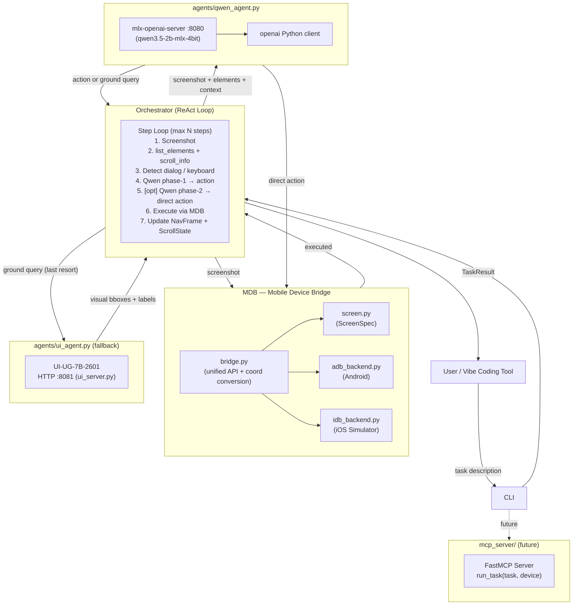

# auto-simctl: Intelligent Mobile Simulator Control

> **Vibe Coding 的最後一塊拼圖** — AI 自動測試手機 app，截圖 → 無障礙樹理解 → Qwen 推理 → 執行 → 回報結果，讓 vibe coding 工具真正能驗收 mobile 開發成果。

## Goal

Close the vibe coding feedback gap: AI agent reads a task, takes screenshots from real/simulated devices, understands the UI via the accessibility tree, executes actions, and reports back — enabling autonomous mobile QA in the coding loop.

---

## Current Status

| Area                        | Status     | Notes                                              |
|-----------------------------|------------|----------------------------------------------------|
| MDB unified bridge          | ✅ Done     | `adb` + `idb`, all core actions                   |
| iOS accessibility tree      | ✅ Done     | `list_elements()`, `get_scroll_info()`             |
| Qwen-as-director            | ✅ Done     | Phase-1 + Phase-2 reasoning loop                  |
| Navigation stack            | ✅ Done     | `NavFrame` + `ScrollState` per frame               |
| Scroll awareness            | ✅ Done     | off-screen element detection, scroll recipes       |
| System dialog detection     | ✅ Done     | auto-dismiss permission / alert dialogs            |
| Keyboard detection          | ✅ Done     | `input_text()` triggered when keyboard is open     |
| Dead-end detection          | ✅ Done     | same action 3× → force HOME                        |
| Semantic language bridging  | ✅ Done     | Qwen maps Chinese task → English labels, no tables |
| UI-UG server                | ✅ Done     | background HTTP on `:8081`, fallback only          |
| Server management CLI       | ✅ Done     | `cli.py server start/stop/status`                  |
| Task cancellation           | ✅ Done     | new task cancels previous in-flight run            |
| MCP server                  | 🔲 Future  | FastMCP skeleton exists                            |
| Android backend             | 🔲 Partial | structure complete, not battle-tested              |

---

## Architecture



---

## Project Structure

```
auto-simctl/
├── PLAN.md                        # this document
├── README.md
├── pyproject.toml                 # Python project + deps
├── setup.sh                       # auto-installer (adb, idb, models)
├── cli.py                         # CLI entry point (typer + rich)
├── ui_server.py                   # UI-UG-7B-2601 HTTP server (port 8081)
├── logger.py                      # structured logging
│
├── mdb/                           # Mobile Device Bridge
│   ├── bridge.py                  # DeviceBridge unified API + coord conversion
│   ├── screen.py                  # ScreenSpec: pixel ↔ pt ↔ norm1000
│   ├── models.py                  # DeviceInfo, Action, Screenshot, UIElement
│   └── backends/
│       ├── idb_backend.py         # iOS: all actions + accessibility + dialog detection
│       └── adb_backend.py         # Android: same interface via adb
│
├── agents/
│   ├── qwen_agent.py              # Qwen3.5-2B reasoning (phase-1 + phase-2)
│   ├── ui_agent.py                # UI-UG-7B-2601 client → ui_server.py
│   └── prompts.py                 # SYSTEM_PROMPT + build_user_message
│
├── orchestrator/
│   ├── loop.py                    # ReAct loop, nav stack, dead-end detection
│   └── result.py                  # TaskResult, StepLog, NavFrame, ScrollState
│
├── mcp_server/
│   └── server.py                  # FastMCP server skeleton (future)
│
└── .cursor/skills/
    └── auto-simctl-navigation/
        └── SKILL.md               # navigation patterns, coordinate systems, failure modes
```

---

## Component Details

### 1. `cli.py` — CLI Entry Point

Commands:

```bash
python3 cli.py server start           # start Qwen (:8080) + UI-UG (:8081) servers
python3 cli.py server stop            # stop both
python3 cli.py server status          # show which servers are running
python3 cli.py devices                # list booted simulators + connected Android devices
python3 cli.py run "<task>" [options] # run a task
  --device auto|<udid>                # device selection (default: first booted)
  --max-steps 20                      # iteration cap
  --verbose                           # stream step-by-step rich output
  --output json|text                  # final result format
```

When a new `run` command arrives while a task is in flight, the previous task is cancelled.

---

### 2. `mdb/` — Unified Mobile Device Bridge

**`bridge.py`** — `DeviceBridge` class:

| Method                          | Description                                               |
|---------------------------------|-----------------------------------------------------------|
| `list_devices()`                | All booted iOS Simulators + connected Android devices     |
| `first_device()`                | Auto-select first booted device                           |
| `boot_simulator(udid)`          | Boot + open Simulator.app window                          |
| `screenshot(udid)`              | Returns `Screenshot` (PNG bytes + dimensions)             |
| `tap(udid, x, y)`               | Tap at logical point coords                               |
| `swipe(udid, x1,y1,x2,y2,ms)`  | Swipe / scroll gesture                                    |
| `input_text(udid, text)`        | Type text into focused field                              |
| `press_key(udid, key)`          | HOME / BACK / ENTER / LOCK / VOLUME_UP / VOLUME_DOWN      |
| `launch_app(udid, app_id)`      | Launch by bundle ID (iOS) or package name (Android)       |
| `dump_ui(udid)`                 | Raw accessibility tree (JSON for iOS, XML for Android)    |
| `list_elements(udid)`           | Parsed flat list of all labeled elements (visible + off-screen) |
| `get_scroll_info(udid)`         | Scroll boundary flags + total content size                |
| `detect_system_dialog(udid)`    | Detect system alert/permission dialog overlay             |
| `find_element_by_label(udid, kw)` | Fast accessibility label lookup                         |
| `execute(udid, action)`         | Dispatch any `Action` object; auto-converts norm1000 coords |

**`screen.py`** — `ScreenSpec` manages three coordinate spaces:

| Space     | Description                                | Who uses it                          |
|-----------|--------------------------------------------|--------------------------------------|
| `pixel`   | Screenshot PNG pixels                      | Image dimensions                     |
| `pt`      | Logical points (device resolution / scale) | `idb tap`, `idb swipe`, all actions  |
| `norm1000`| 0–1000 normalized x/y                      | UI-UG-7B output                      |

Conversion: `pt = round(norm * device_pts / 1000)`. Scale factor inferred from device name (e.g. iPhone 16 Pro = `@3.0x`), with screenshot dimensions as ground truth.

**`idb_backend.py`** — iOS-specific features:

- **`list_elements()`**: Runs `idb ui describe-all`, parses the JSON accessibility tree, returns flat list with `{label, type, cx, cy, x, y, width, height, visible}`. `visible=True` if element center is within screen bounds. Sorted top-to-bottom, left-to-right (reading order).
- **`get_scroll_info()`**: Computes `has_content_above/below/left/right` by checking element cy/cx values against screen bounds. Returns estimated `content_height_pt` / `content_width_pt`.
- **`detect_system_dialog()`**: Walks the accessibility tree looking for modal alert/permission overlays. Guards against false positives:
  - **Keyboard guard**: any single-letter Button → not a dialog (it's the software keyboard)
  - **Max-button guard**: more than 4 buttons → not a dialog (it's a list/toolbar)
  - **Meaningful text guard**: dialog must have real message text (question sentence or permission keyword)
  - `"continue"` removed from `_ALERT_WORDS` (too common in non-dialog contexts)

---

### 3. `agents/qwen_agent.py` — Reasoning Engine

Calls `qwen3.5-2b-mlx-4bit` via local `mlx-openai-server` (OpenAI-compatible API at `:8080`).

**Two-phase reasoning loop:**

**Phase 1** (`grounding_result=None`): Qwen sees screenshot + all accessibility elements + task + history → outputs one action. If the action is `ground`, the orchestrator resolves it (see below) and calls phase-2.

**Phase 2** (`grounding_result=[...]`): Qwen sees the resolved elements → must output a direct `tap`/`swipe`/etc. action. No `ground` allowed.

**`ground` resolution priority:**
1. If accessibility elements are non-empty → pass them directly to Qwen phase-2 (no UI-UG call)
2. If accessibility is empty (custom canvas / game view) → call UI-UG-7B visual grounding → pass bboxes to Qwen phase-2

**Inputs to `decide()`:**
- `task`, `screenshot_data_url` (base64 PNG), `ui_elements`, `history`
- `nav_stack` (navigation breadcrumbs), `dialog_info`, `scroll_info`
- `keyboard_open` (bool) — triggers `input_text` guidance in the prompt

---

### 4. `agents/prompts.py` — System Prompt & Context

**`SYSTEM_PROMPT`** rules (evaluated in order every step):

| Rule | Name                | Description                                                             |
|------|---------------------|-------------------------------------------------------------------------|
| 0    | Keyboard / Text     | If keyboard open → `input_text()`, never tap individual keys            |
| 1    | Done detection      | If Heading/NavigationBar label matches task target → `done`             |
| 2    | Element matching    | Tap Button/Cell semantically matching the target; bridge Chinese→English |
| 3    | Done requirements   | Must have clear visual proof; never assume done if screen unchanged     |
| 4    | Coordinates         | Origin top-left; iPhone 16 Pro logical screen 402×874pt                 |
| 5    | Navigation          | BACK = up one level; HOME = return to launcher                          |
| 6    | Scrolling           | `has_content_below` → `swipe(201,700,201,200)`; off-screen elements guide direction |
| 7    | Dead-end            | Same action repeated → go BACK or try a different path                  |

**`build_user_message()`** injects per-step context:
- Active dialog (highest priority — handle first)
- Keyboard banner (`⌨️ KEYBOARD IS OPEN — use input_text()`)
- Navigation breadcrumbs with scroll offsets
- Scroll boundary summary
- Recent action history (last 4 steps)
- Visible elements table (label, type, tap coords) — keyboard keys filtered out
- Off-screen elements table (direction from viewport)

---

### 5. `orchestrator/result.py` — State Dataclasses

```python
@dataclass
class ScrollState:
    scroll_y: int = 0          # accumulated scroll down in logical pts
    scroll_x: int = 0          # accumulated scroll right
    at_top:    bool = True
    at_bottom: bool = False
    at_left:   bool = True
    at_right:  bool = False
    content_height_hint: int = 0
    content_width_hint:  int = 0

@dataclass
class NavFrame:
    depth: int
    screen_label: str          # Qwen's description (used as breadcrumb)
    action_taken: Action       # the action that entered this screen
    step: int
    scroll: ScrollState = field(default_factory=ScrollState)

@dataclass
class TaskResult:
    success: bool
    steps_taken: int
    conclusion: str
    logs: list[StepLog]
    blocked_reason: Optional[str]
    device_udid: str
    task: str
```

---

### 6. `orchestrator/loop.py` — ReAct Control Loop

```
while step <= max_steps:
    shot = mdb.screenshot(device)
    acc_elements = mdb.list_elements(device)
    keyboard_open = any single-letter Button in acc_elements
    scroll_info = mdb.get_scroll_info(device)  [if not keyboard_open]
    dialog = mdb.detect_system_dialog(device)
    if dialog:
        auto_dismiss(dialog)
        continue  # re-screenshot next step

    action = qwen.decide(task, shot, acc_elements, ..., keyboard_open, scroll_info)

    if action.type == "ground":
        if acc_elements:
            action = qwen.decide(..., grounding_result=acc_elements)  # phase-2
        else:
            visual = ui_agent.ground(shot, query)
            action = qwen.decide(..., grounding_result=visual)         # phase-2

    if action.type == "done":  break
    mdb.execute(action)

    # Update navigation stack
    if is_navigation_action(action):    nav_stack.push(NavFrame(...))
    elif is_scroll_swipe(action):       nav_stack[-1].scroll.update(dy, scroll_info)
    elif action == BACK:                nav_stack.pop(); reset scroll
    elif action == HOME:                nav_stack.clear()

    # Dead-end detection
    if same action 3×: force press_key(HOME)

return TaskResult(success, steps, logs)
```

**`_swipe_direction(action)`** classifies swipes:
- `scroll_down` / `scroll_up`: short vertical swipe → updates `ScrollState`, stays on same `NavFrame`
- `scroll_left` / `scroll_right`: short horizontal swipe → updates `scroll_x`
- `navigate`: large horizontal swipe → pushes new `NavFrame`

---

### 7. `ui_server.py` — UI-UG-7B HTTP Server

Loads `neovateai/UI-UG-7B-2601` (4-bit quantized) via `mlx-vlm` and serves it on `:8081`.

Used only as **fallback** when accessibility tree is empty (custom-drawn views, games, canvas UIs). In practice, iOS apps return rich accessibility data via `idb ui describe-all`, so UI-UG is rarely needed.

---

### 8. `mcp_server/server.py` — Future MCP Integration

- Exposes `run_task(task: str, device_udid: str)` as an MCP tool
- Vibe coding IDEs (Cursor, Claude Desktop) can call this to autonomously validate mobile changes
- Uses FastMCP framework

---

## Coordinate System

| Space     | Range           | Who produces it        | Who consumes it        |
|-----------|-----------------|------------------------|------------------------|
| `pixel`   | e.g. 1206×2622  | screenshot PNG         | image display          |
| `pt`      | e.g. 402×874    | `idb ui describe-all`  | `idb tap`, `idb swipe` |
| `norm1000`| 0–1000 × 0–1000 | UI-UG-7B output        | auto-converted by MDB  |

iPhone 16 Pro: `@3.0x` scale → pixel = pt × 3. `ScreenSpec` handles all conversions, using screenshot dimensions as ground truth.

**Action coordinates**: Qwen always outputs logical points (pt space). UI-UG outputs norm1000, which `DeviceBridge.execute()` auto-converts when `action._from_grounding` is set.

---

## Two-Model Architecture

| Model                   | Role                                                | Inference           | Port  |
|-------------------------|-----------------------------------------------------|---------------------|-------|
| `qwen3.5-2b-mlx-4bit`  | Reasoning: task understanding, action planning, semantic language bridging, done detection | `mlx-openai-server` | 8080 |
| `UI-UG-7B-2601`         | Vision fallback: visual element grounding for custom views | `mlx-vlm` via `ui_server.py` | 8081 |

Qwen does **not** need UI-UG for standard iOS apps — the accessibility tree provides accurate element labels and coordinates in logical points. UI-UG is reserved for UIs without accessibility support.

**Semantic language bridging**: Qwen natively maps Chinese task descriptions to English UI labels. No hardcoded translation tables exist anywhere in the codebase — this is an intentional design decision. Qwen reasons over the raw labels it receives.

---

## Dependency Summary

- `mlx-openai-server` — serves Qwen as local OpenAI-compatible HTTP API
- `mlx-vlm` — loads UI-UG-7B-2601 for `ui_server.py`
- `openai` — Python client to call the local mlx-openai-server
- `fb-idb` (pip) + `idb-companion` (Homebrew) — iOS Simulator control
- `pure-python-adb` — Android control Python client
- `typer` — CLI framework
- `rich` — terminal output: colored step logs, progress, final report
- `fastmcp` — future MCP server framework

---

## Output Format

```json
{
  "success": true,
  "steps_taken": 3,
  "conclusion": "Settings app is open.",
  "blocked_reason": null,
  "evidence": [
    {"step": 1, "action": "tap(337, 425)", "ui_elements_count": 13},
    {"step": 2, "action": "done", "ui_elements_count": 8}
  ]
}
```

---

## Known Limitations & Future Work

- **Android backend**: Structure complete but not battle-tested against real apps.
- **UI-UG accuracy**: Coordinates from visual grounding are sometimes inaccurate on iOS; accessibility tree is always preferred.
- **Multi-device**: Currently single-device per run; parallel runs not supported.
- **MCP server**: Skeleton only — not connected to the orchestrator yet.
- **Model upgrades**: Architecture supports any OpenAI-compatible model at `:8080`; Qwen model path is configurable.
